+++
draft = false
date = '2025-08-16T14:00:00+01:00'
title = 'MCP Gateway'
+++



```mermaid
flowchart LR
    %% Left: Clients
    subgraph A [" "]
        subgraph Clients ["🖥️ Clients"]
            C1[Web Application]
            C2[Mobile App] 
            C3[CLI Tool]
            C4[API Client]
        end
    end
    
    %% Middle: MCP Gateway
    subgraph B [" "]
        subgraph Gateway ["🛡️ MCP Gateway"]
            AUTH[Authentication]
            RATE[Rate Limiting]
            VALID[Request Validation]
            POLICY[Policy Enforcement]
            PROXY[Request Proxy]
            SANIT[Response Sanitization]
            AUDIT[Audit Logging]
        end
    end
    
    %% Right: MCP Servers
    subgraph C [" "]
        subgraph Servers ["🔧 MCP Servers"]
            S1[Weather Server]
            S2[Database Server]
            S3[AI Tools Server]
            S4[External APIs]
        end
    end
    
    %% Flow: Left to Middle to Right
    A --> B
    B --> C
    
    %% Hide the wrapper subgraph borders
    style A fill:transparent,stroke:transparent
    style B fill:transparent,stroke:transparent  
    style C fill:transparent,stroke:transparent
    
    %% Style the components
    style AUTH fill:#4a90e2,stroke:#ffffff,stroke-width:2px,color:#ffffff
    style RATE fill:#7b68ee,stroke:#ffffff,stroke-width:2px,color:#ffffff
    style VALID fill:#50c878,stroke:#ffffff,stroke-width:2px,color:#ffffff
    style POLICY fill:#ffa500,stroke:#ffffff,stroke-width:2px,color:#ffffff
    style PROXY fill:#ff6b6b,stroke:#ffffff,stroke-width:2px,color:#ffffff
    style AUDIT fill:#98fb98,stroke:#ffffff,stroke-width:2px,color:#000000
    style SANIT fill:#40e0d0,stroke:#ffffff,stroke-width:2px,color:#ffffff
```

## A Security-Focused Gateway for Model Context Protocol Servers

### The Challenge

As AI applications become increasingly sophisticated, they rely heavily on external tools and data sources through protocols like the Model Context Protocol (MCP). While MCP enables powerful integrations between AI systems and various services, it also introduces significant security challenges. Direct connections between AI clients and MCP servers can expose sensitive data, lack proper access controls, and create potential attack vectors for malicious actors.

Traditional approaches often leave organizations with a difficult choice: either restrict AI capabilities to maintain security, or accept increased risk to unlock the full potential of their AI systems.

### The Solution

MCP Gateway addresses this challenge by providing a lightweight, security-focused intermediary service that sits between MCP clients and servers. It acts as a intelligent proxy that enforces security policies while maintaining the flexibility and power of MCP integrations.

The gateway's core functionality includes:
* **Authentication & Authorization**: Token-based authentication with granular, per-client security policies
* **Request Validation**: Validates all requests against allowed tools and resources before forwarding
* **Rate Limiting**: Implements token bucket algorithms to prevent abuse and ensure fair resource usage
* **Response Sanitization**: Automatically removes sensitive information from responses
* **Audit Logging**: Comprehensive logging of all requests and responses for security monitoring
* **Policy Enforcement**: Configurable security policies that can be tailored to each client's needs

### Why I Built It

During my work with AI systems and security architecture, I've observed a growing gap between the security requirements of enterprise environments and the capabilities offered by emerging AI protocols. While MCP provides excellent functionality for AI tool integration, it lacks the enterprise-grade security controls that organizations need.

MCP Gateway represents my attempt to bridge this gap by providing a production-ready security layer that doesn't compromise on functionality. It's designed to be simple enough for individual developers to deploy locally, yet robust enough to handle enterprise-scale deployments with multiple clients and strict security requirements.

### Technical Architecture

The gateway implements a defense-in-depth security model with multiple layers of protection:

```mermaid
sequenceDiagram
    participant Client
    participant Gateway
    participant MCPServer as MCP Server
    
    Client->>Gateway: 1. HTTP Request + Bearer Token
    Gateway->>Gateway: 2. Authenticate Token
    Gateway->>Gateway: 3. Check Rate Limits
    Gateway->>Gateway: 4. Validate Against Policy
    Gateway->>MCPServer: 5. Forward Valid Request
    MCPServer->>Gateway: 6. Return Response
    Gateway->>Gateway: 7. Sanitize Response
    Gateway->>Gateway: 8. Log Transaction
    Gateway->>Client: 9. Return Sanitized Response
    
    Note over Gateway: Security Layers:<br/>• Authentication<br/>• Rate Limiting<br/>• Policy Validation<br/>• Response Sanitization<br/>• Audit Logging
```



Each client receives a unique security policy that defines:
- Allowed tools and resources (whitelist approach)
- Rate limiting thresholds
- Request size limits
- CORS origins
- Authentication requirements

### Current State

MCP Gateway is currently available as an open-source project built with FastAPI and Python. The system has been designed with production deployment in mind, featuring:

* **Stateless Architecture**: Enables horizontal scaling and load balancing
* **Configurable Policies**: JSON-based security policies that can be customized per client
* **Comprehensive Logging**: Structured audit logs for security monitoring and compliance
* **Health Monitoring**: Built-in health checks and monitoring endpoints
* **Development-Friendly**: Easy local setup with minimal dependencies

The project includes comprehensive documentation, example configurations, and a test suite to help organizations evaluate and deploy the gateway in their environments.

### Security Features

The gateway implements several key security patterns:

**Authentication**: Bearer token-based authentication with client-specific tokens and policies
**Authorization**: Granular access control based on tools, resources, and request patterns  
**Rate Limiting**: Token bucket algorithm prevents abuse while allowing burst traffic
**Input Validation**: All requests are validated against security policies before processing
**Output Sanitization**: Responses are automatically scrubbed of sensitive information
**Audit Trail**: Complete request/response logging for security monitoring and compliance

### Future Enhancements

While the current implementation provides a solid foundation, I'm actively working on several enhancements:

* **JWT Token Support**: More sophisticated token management with expiration and refresh
* **OAuth2 Integration**: Enterprise identity provider integration
* **Container Sandboxing**: Isolated execution environments for enhanced security
* **WebSocket Support**: Real-time communication capabilities
* **Distributed Rate Limiting**: Redis-backed rate limiting for multi-instance deployments
* **Monitoring Integration**: Prometheus metrics and Grafana dashboards

### Getting Started

The gateway is designed to be easy to deploy and configure. A basic setup requires only:

```bash
pip install -r requirements.txt
python main.py
```

The system starts with sensible defaults and includes a test client for immediate evaluation. Production deployments can leverage the comprehensive configuration options and security policies to meet specific organizational requirements.

I welcome feedback, contributions, and discussions about securing AI integrations and MCP deployments. The project represents my ongoing commitment to making AI systems more secure and enterprise-ready without sacrificing their innovative potential.

You can find the full source code, documentation, and deployment guides on GitHub [here](https://github.com/marklechner/mcpgw).
